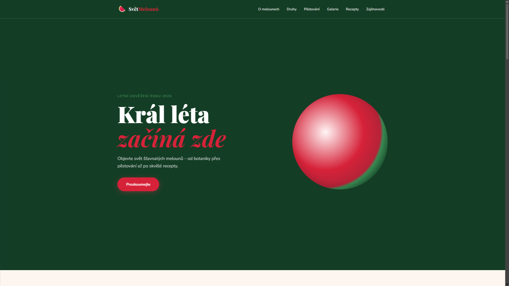
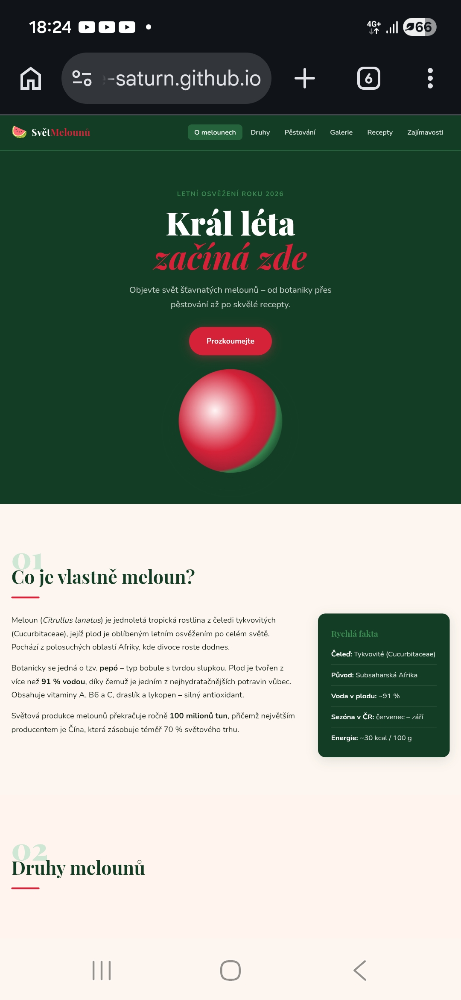

# 🍉 Svět Melounů – Letní Osvěžení

Komplexní a plně optimalizovaná webová prezentace zaměřená na svět melounů. Projekt byl vyvinut čistě pomocí nativních webových technologií s důrazem na přístupnost, výkon a čistotu kódu "pod kapotou".

* **Autor:** Petr Pelc
* **Živý web (GitHub Pages):** [https://ice-saturn.github.io/AI-slopinator/Meloun%20web/index.html](https://ice-saturn.github.io/AI-slopinator/Meloun%20web/index.html)
* **GitHub Repozitář:** [https://github.com/ice-saturn/AI-slopinator/tree/main/Meloun%20web](https://github.com/ice-saturn/AI-slopinator/tree/main/Meloun%20web)

---

## 💻 Použité technologie & Vývojové prostředí

* **HTML5:** Sémantická struktura dokumentu, zajištění nativní přístupnosti.
* **CSS3:** Pokročilá typografie, CSS Grid, Flexbox architektura, Custom Variables.
* **Vanilla JavaScript (ES6+):** Reaktivita mobilního rozhraní a pokročilé asynchronní animace.
* **IDE:** Visual Studio Code (v1.92) s rozšířením *Live Server* pro lokální testování.
* **AI Nástroje:** ChatGPT-4o a Claude 3.5 Sonnet pro generování textového obsahu a audit barevného kontrastu.

---

## 📂 Adresářová struktura

```text
svet-melounu/
│
├── index.html          # Hlavní sémantický dokument HTML5
├── style.css           # Kompletní CSS architektura bez externích frameworků
├── script.js           # Vanilla JS logika (hamburger menu, scroll-reveal observer)
├── robots.txt          # Konfigurace přístupu vyhledávacích robotů
├── sitemap.xml         # Mapa stránek pro indexaci vyhledávači
└── img/                # Adresář pro optimalizovaná média
    ├── galerie-1.webp  # Ukázka optimalizovaného formátu obrázku
    └── ...
```

---

### 1. Výkon (Performance)
* **Teoretický popis:** Rychlost a datová nenáročnost webové prezentace byly maximalizovány úplnou eliminací jakýchkoliv externích knihoven a stylopisů (byl zcela odstraněn původně zvažovaný Bootstrap framework, čímž se ušetřily zbytečné HTTP požadavky a snížila celková velikost přenášených dat). Všechny rastrové obrázky v galerii byly zkomprimovány a převedeny do moderního a úsporného formátu `.webp`. Pro celou mřížku sekce `#galerie` bylo implementováno nativní asynchronní odložené načítání pomocí atributu `loading="lazy"`. Prohlížeč tak stahuje binární data obrázků až ve chvíli, kdy uživatel scrollováním prokazatelně směřuje k dané sekci. Každý tag `` má navíc pevně definované rozměry `width` a `height`, což zabraňuje nežádoucímu posunu prvků na stránce během asynchronního načítání na pozadí (tzv. *Cumulative Layout Shift – CLS*) a stabilizuje celkové skóre v auditech Google Lighthouse.
* **Výstřižek kódu:**

---

```html
<figure class="gallery-item reveal" role="listitem">
  
  <figcaption>Celý vodní meloun na slunci</figcaption>
</figure>
```

---

## 2. SEO (Search Engine Optimization)

**Teoretický popis:** Stránka striktně dodržuje sémantická pravidla specifikace HTML5. Kód obsahuje pouze jeden hlavní strukturní nadpis `<h1>` umístěný v úvodní sekci Hero. Jednotlivé logické celky jsou rozděleny do samostatných elementů `<section>`, které jsou pro vyhledávací roboty jednoznačně pojmenovány a identifikovány pomocí atributu `aria-labelledby` odkazujícího na ID příslušného podnadpisu. Hlavička `<head>` obsahuje korektní specifikaci jazyka `lang="cs"` a plně nakonfigurované meta tagy pro popis stránky (`description`) a klíčová slova (`keywords`). Indexaci vyhledávačů a navigaci robotů navíc napomáhají dedikované konfigurační soubory `robots.txt` a `sitemap.xml` umístěné v kořenovém adresáři projektu.

**Výstřižek kódu:**

```html
<section id="druhy" class="bg-stripe" aria-labelledby="nadpis-druhy">
  <div class="container section-wrap">
    <div class="section-label reveal" aria-hidden="true">02</div>
    <h2 id="nadpis-druhy" class="section-title reveal">Druhy melounů</h2>
  </div>
</section>
```

---

## 3. Přístupnost (Accessibility)

**Teoretický popis:** Webová prezentace byla navržena a optimalizována tak, aby vyhovovala mezinárodním standardům přístupnosti WCAG 2.1 AA / AAA. Původní barevné odstíny textů, odkazů a doplňkových elementů v CSS byly revidovány a matematicky ztmaveny (např. posun barvy hlavního textu a radikální zvýšení kontrastu u ztlumeného textu `--clr-text-muted` vůči světlému podkladu), čímž se dosáhlo kontrastního poměru minimálně 4.5:1. Stránka je plně ovladatelná i bez použití myši – pouze pomocí klávesových úhozů (Tab, Enter). Interaktivní prvek mobilního hamburger menu je osazen přístupnostními atributy (`aria-expanded`, `aria-controls` a `aria-hidden`), které JavaScript dynamicky přepíná v reálném čase. Asistenční technologie (čtečky obrazovky) tak mají v každém okamžiku exaktní informaci o stavu navigace. Čistě dekorativní grafika a emotikony jsou před čtečkami schovány pomocí `aria-hidden="true"`, aby nerušily syntézu řeči.


**Výstřižek kódu:**

```css
:root {
  --clr-bg:        #fdf6f0;
  --clr-green-dk:  #143d25;          /* Ztmavená zelená pro bezchybný kontrast textu */
  --clr-text:      #111c11;          /* Ztmavený hlavní text pro maximální čitelnost */
  --clr-text-muted:#465746;          /* Zvýšený kontrast splňující WCAG standard AA */
}
```
---

## 4. Sociální sítě (Social Media)

**Teoretický popis:** Pro zajištění vysoké estetické a informační hodnoty při sdílení obsahu byly do hlavičky dokumentu integrovány sady metadat protokolů Open Graph (OG) pro sítě Facebook či LinkedIn a X (Twitter) Cards. Tato strukturovaná data explicitně definují typ sdíleného objektu, kanonickou URL adresu, chytlavý titulek, stručný popisek a absolutní webovou cestu k reprezentativnímu náhledovému obrázku. Pokud uživatel nasdílí odkaz do konverzace nebo na zeď sociální sítě, automaticky se vygeneruje bohatá vizuální karta, která rapidně zvyšuje míru prokliku (CTR).

**Výstřižek kódu:**

```html
<meta property="og:type" content="website" />
<meta property="og:url" content="[https://ice-saturn.github.io/AI-slopinator/Meloun%20web/index.html](https://ice-saturn.github.io/AI-slopinator/Meloun%20web/index.html)" />
<meta property="og:title" content="Svět Melounů – Letní Osvěžení" />
<meta property="og:description" content="Objevte svět šťavnatých melounů – od botaniky přes pěstování až po skvělé recepty." />
<meta property="og:image" content="[https://ice-saturn.github.io/AI-slopinator/Meloun%20web/img/1.png](https://ice-saturn.github.io/AI-slopinator/Meloun%20web/img/1.png)" />
```

---

## 5. UI/UX & Responzivita

**Teoretický popis:** Uživatelské rozhraní staví na moderní vizuální hierarchii, plynulé typografii a čistém layoutu. K rozvržení prvků se zásadně nevyužívají žádné externí knihovny, nýbrž moderní nativní standardy CSS Grid (pro produktové a galerijní mřížky) a CSS Flexbox (pro flexibilní navigaci a dvousloupcové textové sekce). Web je plně responzivní a reaguje na šířku klientského zařízení pomocí CSS `@media` pravidel. Při přechodu z desktopu na mobilní telefony se vícesloupcové mřížky plynule transformují do přehledného jednosloupcového zobrazení řazeného pod sebou. Všechny interaktivní a dotykové prvky (odkazy v navigaci, tlačítka) striktně splňují ergonomická doporučení ohledně velikosti aktivní zóny (minimálně 44x44px), což spolehlivě zabraňuje nechtěným překlikům na dotykových displejích.

**Výstřižek kódu:**

```css
@media (max-width: 768px) {
  .nav-links { display: none; }
  .hamburger { display: flex; }
  .nav-mobile.active { display: flex; }
  
  .card-grid, .gallery-grid, .recipe-grid, .facts-grid {
    grid-template-columns: 1fr; /* Transformace mřížky na jeden sloupec pro mobilní telefony */
  }
}
```

---

## 6. AI Integrace

**Teoretický popis:** Umělá inteligence (modely ChatGPT a Claude) byla do vývojového cyklu aktivně zapojena jako komplexní asistent v několika fázích. V počátku posloužila k rešerši, strukturování a vygenerování fakticky správných textových podkladů v českém jazyce (odborné botanické informace, nutriční hodnoty, kroky pro pěstování). V technické fázi vývoje byla AI využita jako auditor napsaného zdrojového kódu. Analyzovala CSS stylopis, matematicky přepočítala kontrastní poměry zvolených barev a navrhla optimální korekci HEX hodnot tak, aby web vyhověl testům přístupnosti. Rovněž pomohla s návrhem asynchronního JavaScriptu využívajícího moderní API prohlížeče, čímž se předešlo zbytečnému znečišťování globálního jmenného prostoru.

**Výstřižek kódu (Optimalizovaný JavaScript z script.js):**

```javascript
const observer = new IntersectionObserver(entries => {
  entries.forEach(entry => {
    if (entry.isIntersecting) {
      const siblings = Array.from(
        entry.target.parentElement.querySelectorAll('.reveal:not(.visible)')
      );
      const idx = siblings.indexOf(entry.target);
      const delay = Math.min(idx * 80, 400); // Kaskádový efekt animace

      setTimeout(() => {
        entry.target.classList.add('visible');
      }, delay);

      observer.unobserve(entry.target); // Úspora paměti po animaci
    }
  });
}, observerOptions);
```

## 🤖 AI Deník (Seznam promptů)

### Prompt pro textový obsah
> „Vytvoř mi odborný, ale atraktivní textový obsah v češtině pro jednostránkový web o melounech. Rozděl text do sekcí: Botanický úvod, Druhy melounů s ukázkami odrůd, Návod na pěstování v 5 krocích od předpěstování po sklizeň, 3 letní recepty s ingrediencemi a blok s 6 zajímavostmi. Použij sémantické obraty.“

### Prompt pro technický audit přístupnosti a WCAG
> „Zkontroluj moje CSS proměnné barevné palety. Web má světlé krémové pozadí #fdf6f0. Ověř, zda barva textu #5a6e5a a barvy červených tlačítek splňují kontrastní poměr podle standardu WCAG 2.1 AA pro běžný text. Pokud ne, navrhni přesné korekce HEX kódů tak, aby kód zůstal vizuálně melounový, ale byl vysoce kontrastní.“

### Prompt pro optimalizaci JS animací
> „Mám napsaný JavaScript pro postupné odhalování prvků při scrollování, ale chci ho optimalizovat, aby byl výkonný. Napiš řešení pomocí čistého Vanilla JS a Intersection Observer API. Chci, aby se animace spustila s mírným kaskádovým zpožděním u prvků, které jsou vedle sebe, a aby se po provedení animace sledování prvku ukončilo kvůli úspoře paměti.“

## 🚀 Instalace a spuštění

Pro lokální spuštění, testování a validaci projektu na vlastním počítači postupujte podle následujících kroků:

1. Naklonujte si tento repozitář na svůj lokální disk pomocí gitu:

    ```bash
    gh repo clone ice-saturn/AI-slopinator
    ```
2. Otevřete adresář v editoru **Visual Studio Code**.
3. Klikněte pravým tlačítkem myši na `index.html` a zvolte možnost **Open with Live Server**.
4. Aplikace se spustí na adrese `http://127.0.0.1:5500/`.

---

## 📸 Galerie projektu

| Plná Desktopová Verze | Mobilní responzivní zobrazení |
| :--- | :--- |
|  |  |
